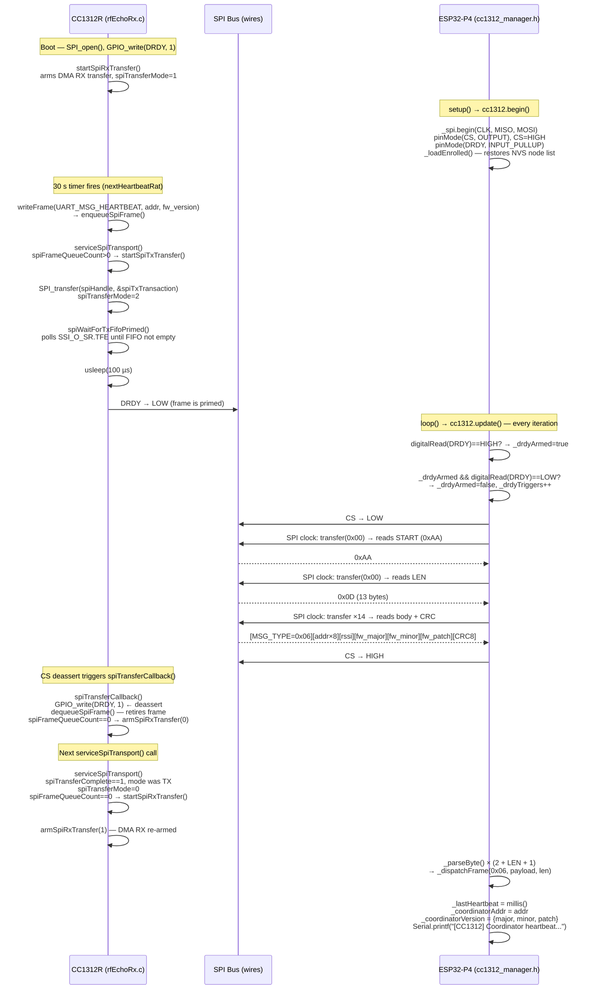
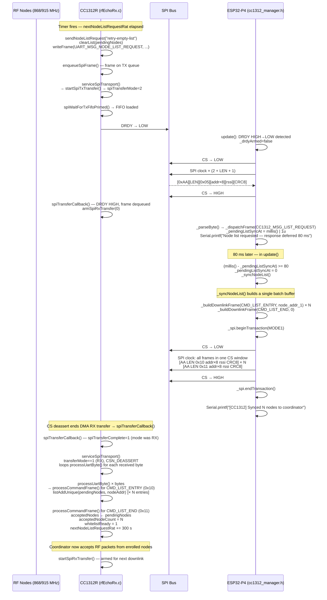
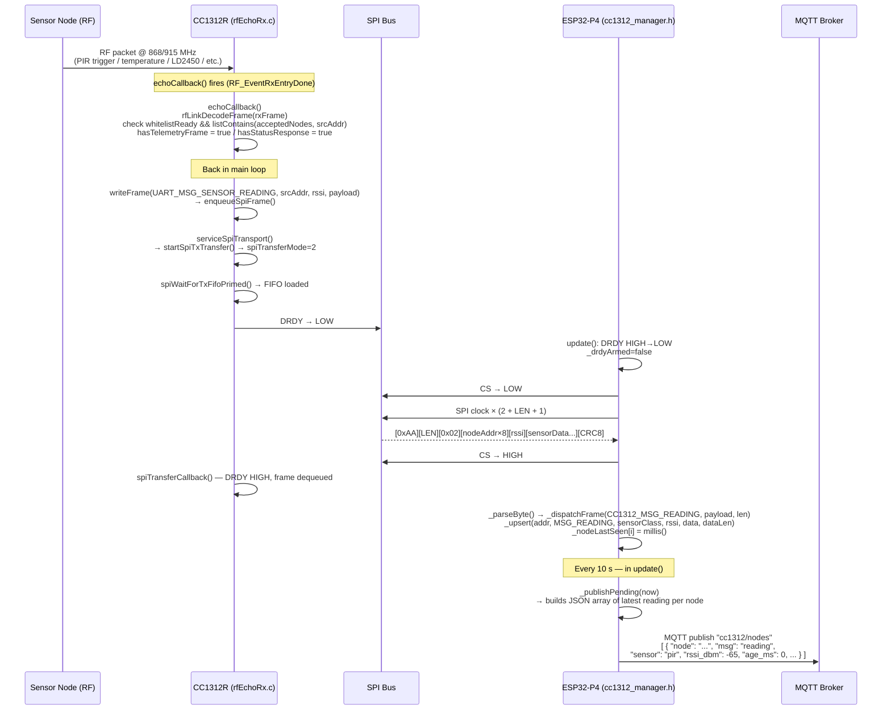
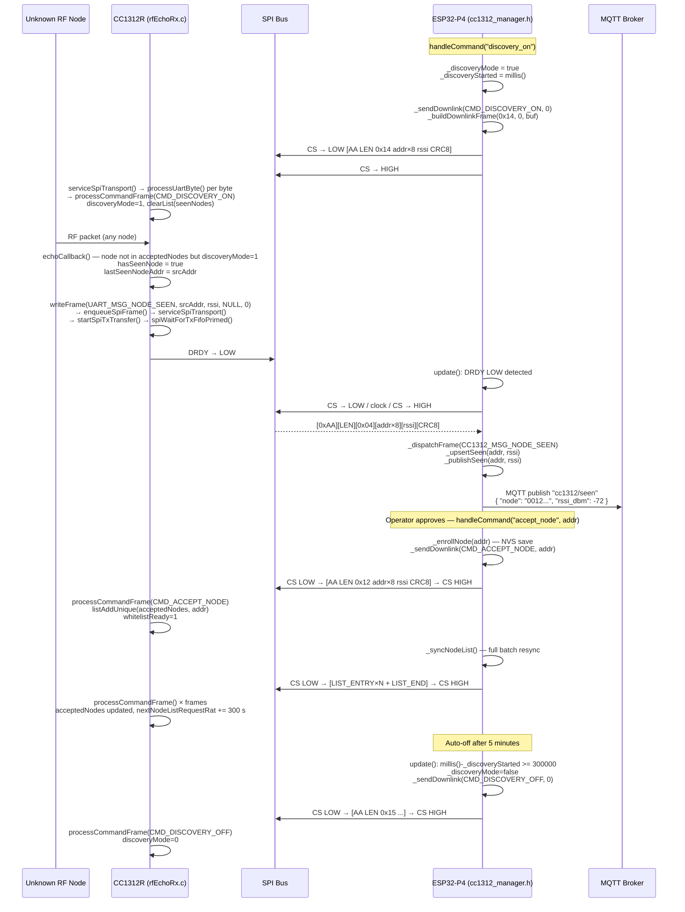
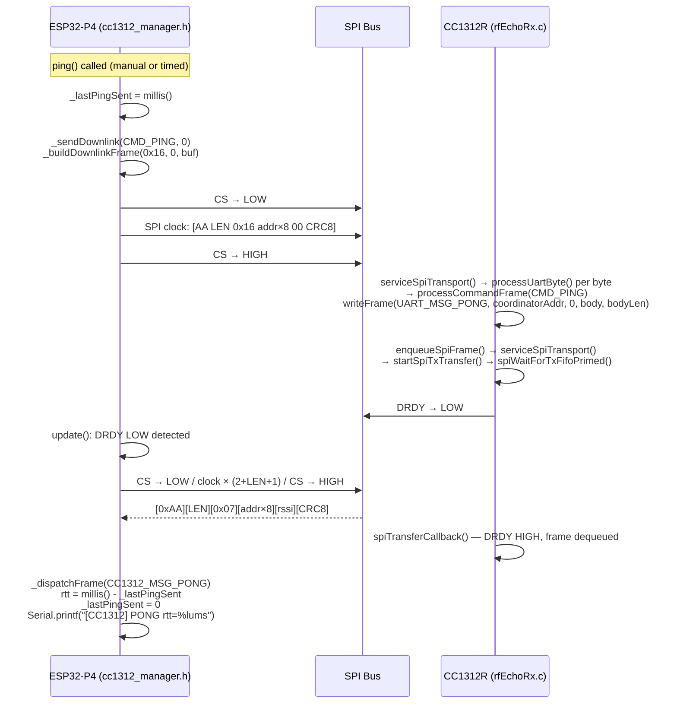
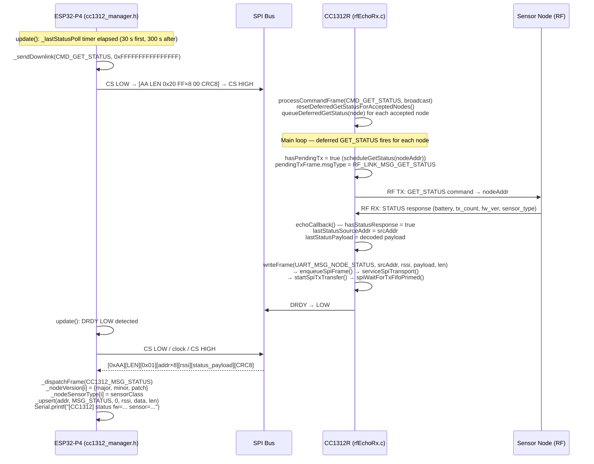
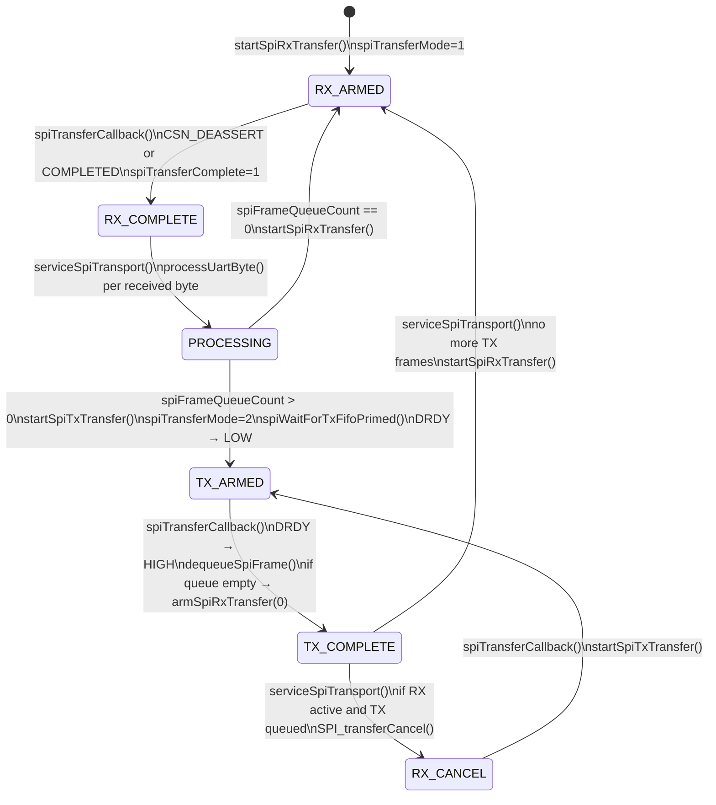

# CC1312R SPI Interaction — Function-Level Sequence Diagrams <!-- trunk-ignore(markdownlint/MD025) -->

This document maps every major interaction between the CC1312R coordinator firmware
(`rfEchoRx.c`) and the ESP32-P4 SPI driver (`cc1312_manager.h`) as Mermaid sequence
diagrams. Each step names the function responsible on each side.

The physical layer beneath all of these flows is the 5-wire SPI link:

```
ESP32-P4 G8  MOSI ──► CC1312R DIO11 SSI_RX
ESP32-P4 G9  MISO ◄── CC1312R DIO9  SSI_TX
ESP32-P4 G10 CLK  ──► CC1312R DIO10 SSI_CLK
ESP32-P4 G11 CS   ──► CC1312R DIO8  SSI_FSS  (active-low)
ESP32-P4 G12 DRDY ◄── CC1312R DIO12 GPIO out (active-low)
```

---

## 1 — Startup and First Heartbeat

Both sides initialise independently. The CC1312R starts its main loop and immediately
arms an SPI RX DMA transfer to listen for downlinks. The first heartbeat is sent 30
seconds after boot.



---

## 2 — Node-List Request and Sync

The CC1312R asks the ESP32-P4 for its enrolled node list on startup (and every 10 s
while the list is empty, or every 300 s as a keepalive once the list is populated).



> **Why the 80 ms defer matters:** the CC1312R deasserts DRDY and queues an RX
> DMA re-arm inside `spiTransferCallback()`, but the actual `startSpiRxTransfer()`
> call only happens the next time `serviceSpiTransport()` runs in the main loop — up to
> 50 ms later (the RF RX window). Without the delay the downlink bytes arrive while the
> SSI hardware FIFO has no active DMA consumer and are silently dropped.

---

## 3 — Sensor Node Data Relay

Once `whitelistReady=1`, the CC1312R accepts RF packets from enrolled nodes and
relays them to the ESP32-P4 as SPI uplink frames.



---

## 4 — Discovery Mode and Node Enrolment

Discovery mode lets the coordinator surface any RF-visible node. The ESP32-P4 enables
it via a downlink command and receives `NODE_SEEN` frames for each new address spotted.
Enrolment is a separate explicit action.



---

## 5 — Ping / Pong Round-Trip

A simple liveness check. The ESP32-P4 sends `CMD_PING`; the coordinator echoes it as
`MSG_PONG`. The RTT is logged.



---

## 6 — Periodic Status Poll

The ESP32-P4 broadcasts `CMD_GET_STATUS` (destination `0xFFFF...FF`) every 5 minutes
to refresh firmware version and sensor-type metadata for all enrolled nodes. The
coordinator re-transmits a `GET_STATUS` RF command to each node, which responds with
an RF status payload that the coordinator then relays as a `MSG_STATUS` uplink.



---

## 7 — SPI State Machine Summary (CC1312R side)

`serviceSpiTransport()` is the core dispatcher called twice per main-loop iteration
(once after `RF_runCmd()`, once after frame writes). Its state transitions are:



---

## Key Timing Constants

| Constant | Value | Where set | Meaning |
|---|---|---|---|
| Heartbeat interval | 30 s | `HEARTBEAT_INTERVAL_RAT` | CC1312R periodic uplink |
| Node-list retry (empty) | 10 s | `NODE_LIST_EMPTY_RETRY_RAT` | Retry when `acceptedNodeCount == 0` |
| Node-list keepalive | 300 s | `NODE_LIST_KEEPALIVE_RAT` | Keepalive once list is populated |
| DRDY-to-downlink delay | 80 ms | `_pendingListSyncAt` | ESP32-P4 defers sync after list request |
| RF RX window | ~50 ms | `RF_RX_TIMEOUT` | CC1312R `RF_runCmd()` blocking window |
| DRDY no-data alarm | 35 s | diagnostic block | ESP32-P4 warns if DRDY silent |
| Status poll (first) | 30 s | `CC1312_STATUS_POLL_INITIAL_MS` | ESP32-P4 first GET_STATUS |
| Status poll (repeat) | 300 s | `CC1312_STATUS_POLL_INTERVAL_MS` | ESP32-P4 periodic GET_STATUS |
| Discovery auto-off | 300 s | `handleCommand("discovery_on")` | ESP32-P4 auto-disables discovery |
