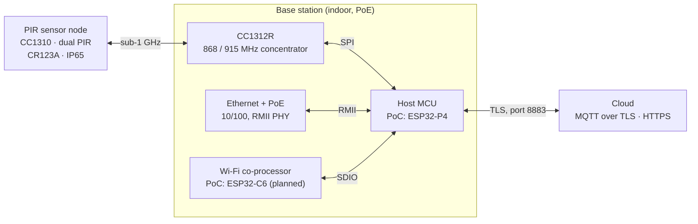

:::info
**Reference, not requirements.** This brief shows how we could build v3 on our
proof of concept's technology (sub-GHz TI CC13xx radios and an ESP32-P4 base
station). What a supplier must deliver is set by the
[functional specification](v3-functional-specification.md) and the
[data contract](v3-data-contract.md), which leave the technology to them.
:::

We want a design partner to turn our working proof of concept (PoC) into two
production products: a **base station** and a **battery PIR sensor node**.
This brief is the starting point for that conversation. It covers what the
PoC hardware is, what it has proven, and what we still need to decide with you.

**What we're asking for:**

- a component-level BOM for each product
- schematic capture and PCB layout, including the sub-1 GHz and 2.4 GHz RF sections
- advice on module versus chip-down choices, with certification cost in mind
- a view on what's missing from this brief before you can quote

## How we'd like to work

1. **Design and development with you,** including prototype builds. The first
   run would be about **5 base stations and 10 sensors**, for our own testing
   and for certification.
2. **A golden sample and a complete design package** once the design is
   final. We expect to take that package to a volume manufacturer, probably in
   China, for larger runs.

That means the design has to transfer cleanly to another factory:

- parts that are easy to buy through volume supply chains, including Chinese
  distributors, with approved alternates for passives and power parts
- standard PCB processes and stack-ups that any volume board house can build
- a full manufacturing package:
  - native CAD files, Gerbers and assembly drawings
  - pick-and-place data
  - a BOM with manufacturer part numbers and alternates
  - the test specification and test-fixture design
  - the programming procedure
- design files and IP owned by us
- your support during the transfer, such as answering the volume manufacturer's
  questions and reviewing first articles

We'd like to know whether this model works for you, and how you'd price the
prototype runs and the transfer support.

The formal product requirements are the
[PIR Sensor v3](https://firebolt.atlassian.net/wiki/spaces/SD/pages/1246429185/PIR+Sensor+v3+Technical+Requirements+and+Design+Proposals+for+PIRW+2026+Redesign) and
[RAIS Base Station v3](https://firebolt.atlassian.net/wiki/spaces/SD/pages/1246625793/RAIS+Base+Station+v3+Technical+Requirements+for+PIRW+2026+Redesign)
technical requirements (project: PIRW 2026 Redesign). Requirement IDs such as
`PWR-1` below refer to those documents. Where the PoC and the requirements
disagree, the difference is listed under [Open questions](#open-questions).

## System overview

Battery PIR sensors count footfall and report over a sub-1 GHz link to an
indoor base station. The base station forwards the data to the cloud over MQTT
with TLS.

Every link is two-way. The base station sends ACKs and settings to sensors,
and the cloud sends commands and firmware updates down. Both products replace
an existing line (the PIRW2 sensor and the RAIS2.1 base station). On this
route, v3 sensors must also work with base stations already installed in the
field, after a concentrator firmware update (`RF-2`).

## Base station

### What the PoC is built from

| Part | Board used | Role in the PoC | Status |
| --- | --- | --- | --- |
| Host MCU | [M5Stack Unit PoE-P4](https://docs.m5stack.com/en/unit/Unit_PoE-P4) (SKU U213) | ESP32-P4NRW32: MQTT over TLS, OTA, web setup, RF node management | Working |
| Ethernet + PoE | On the same board | IP101GRI PHY over RMII; PoE input (board supplies up to 6 W) | Working, including MQTT over TLS |
| Sub-1 GHz concentrator | [TI LAUNCHXL-CC1312R1](https://www.ti.com/tool/LAUNCHXL-CC1312R1) | CC1312R runs the coordinator firmware and forwards node data to the host over SPI | Working on the bench with CC1310 nodes |
| Wi-Fi | ESP32-C6 (dev board) | Wi-Fi co-processor for the P4, using Espressif's ESP-Hosted-MCU firmware over SDIO | **Planned, not yet built** |

The P4 was chosen for the PoC because its RMII Ethernet runs MQTT over TLS
reliably. An earlier ESP32-S3 + W5500 SPI Ethernet build couldn't, because the
Arduino WIZnet library it used runs TCP/IP inside the W5500 and couldn't carry
TLS. That's a library limitation, not a hardware one: the W5500 also works
through the ESP32's own network stack. The ESP32-P4 has **no radio
of its own**, so Wi-Fi needs a second chip. That's why the C6 is in the plan.

### Not wanted in production

- The LaunchPad's XDS110 debugger, USB bridge, buttons and LEDs. Replace them
  with programming pads.
- M5Stack board features we don't use: display and camera FPC connectors, the
  USB host port and the infrared transmitter.
- Two PoC-only sensors: the HLK-LD2450 mmWave radar (UART) and an SPI thermal
  people counter that only ran against an emulated sensor. Neither is in the v3
  requirements.

### What production must add

| Requirement | Summary |
| --- | --- |
| `NET-1`, `NET-2` | 10/100 Ethernet on RJ45, with DHCP and static IP |
| `NET-4` | External, connectorised Wi-Fi antenna (e.g. RP-SMA) on the Wi-Fi variant |
| `PWR-1` | PoE, IEEE 802.3af Class 1, through an isolated PD front end |
| `PWR-2`, `PWR-3` | USB-C 5 V sink (5.1 kΩ CC pull-downs) as the alternative supply; clean PoE/USB-C arbitration |
| `RAD-3`, `RAD-4` | 868 MHz and 915 MHz variants, external sub-GHz antenna, per-band TX power respecting ERP limits |
| `PLT-2` | Field reflash of the CC1312 from the host through the TI ROM bootloader |
| `PLT-3` | Mutual watchdog: the host can reset the CC1312, and the CC1312 can reset the host |
| `MEC-1` | Indoor enclosure with RJ45, USB-C, both antennas, status LEDs and a label area (baseline RAIS2.1 is 137 × 91 × 24 mm) |

## Sensor node

The sensor PoC runs on a [TI LAUNCHXL-CC1310](https://www.ti.com/tool/LAUNCHXL-CC1310).
It proves the RF link and message format only: two GPIO inputs stand in for the
PIR elements and send trigger and dwell events. The production baseline is the
existing **PIRW2** board (CC1310F128RGZ, PCB antenna, CR2354 cell plus a 0.5 F
supercapacitor, hot-glue potting).

v3 changes the sensor significantly:

| Area | v3 requirement |
| --- | --- |
| Battery | CR123A (Li-MnO₂, 3 V), user-replaceable, standard holder (`PWR-2`) |
| Battery life | ≥ 3 years at 15,000 impressions/day, designed to 1,200 mAh usable: derated from about 1,500 mAh nominal for cold, pulse load, self-discharge and cut-off voltage (`PWR-1`) |
| Sleep current | ≤ 5 µA target, ≤ 8 µA absolute maximum, with an itemised budget (`PWR-3`) |
| Supercapacitor | Evaluate removing the 0.5 F part (`PWR-5`) |
| Range | ≥ 99 % packet delivery at 50 m non-line-of-sight, 15–20 dB better link budget than PIRW2 (`RF-1`) |
| Bands | One design for 868 MHz and 915 MHz; antenna measured in both bands in the final enclosure (`RF-4`, `ENV-6`) |
| Enclosure | IP65 by design, not potting; UV-stable, black and white; −20 °C to +60 °C proposed (`ENV-1`, `ENV-3`) |
| Sealed openings | Fresnel lens as the IR window; LEDs visible through a translucent case or a sealed light pipe; reset by a magnet-operated reed switch rather than a button (`ENV-2`) |

The larger CR123A board allows a bigger ground plane, and so a properly tuned
antenna. We estimate that's worth 2–3 dB of the range target. The rest is the
hard part: the v3 PHY (`FW-2`) is about 14 dB less sensitive than the Long
Range mode the PoC uses, and at 868 MHz the ERP limit caps transmit power. We'd
value your view on whether the target is achievable (see
[Open questions](#open-questions)).

Over 3 years, 1,200 mAh is an average of about 46 µA, so radio traffic, not
sleep current, dominates the battery budget.

**LEDs and reset without breaking the seal.** PIRW2 has LEDs and a reset
button. To keep the IP65 rating, v3 would have no openings for them:

- **LEDs:**
  - shine through a translucent case, or through a sealed light pipe
  - a translucent case suits the white variant; the black variant probably
    needs a light pipe or a clear window
  - indications should be short pulses, to protect the battery budget
- **Reset:**
  - a reed switch operated by a magnet held against a marked spot on the case
  - a reed switch draws no standby current, which suits the 5 µA sleep target
  - glass reeds can crack in a drop, so it needs a shock-rated part
  - a nanopower Hall-effect switch is the alternative, but it draws current
    continuously
  - a hold time of a few seconds stops a stray magnet causing a reset

## Interfaces and pin map

These are the base-station PoC connections, on the M5Stack's Hat2-Bus
headers. A production board can choose its own pins; the table shows which
signals exist and how they're used.

| Signal | ESP32-P4 pin | Other end | Notes |
| --- | --- | --- | --- |
| CC1312 SPI MOSI | GPIO 8 | CC1312 DIO11 (SSI RX) | 1 MHz, SPI mode 1 |
| CC1312 SPI MISO | GPIO 9 | CC1312 DIO9 (SSI TX) | |
| CC1312 SPI CLK | GPIO 10 | CC1312 DIO10 | |
| CC1312 SPI CS | GPIO 11 | CC1312 DIO8 (SSI FSS) | Active low |
| CC1312 data ready | GPIO 12 | CC1312 DIO12 | Active low; the CC1312 signals that a frame is waiting |
| C6 SDIO CLK, CMD, D0–D3 | GPIO 43, 44, 39–42 (planned) | C6 GPIO 19, 18, 20–23 | 4-bit, 40 MHz; the P4's SDMMC pins |
| C6 reset | GPIO 13 (planned) | C6 EN | |
| Ethernet PHY | RMII: 28–30, 34, 35, 49, 50; MDC 31, MDIO 52, PHY reset 51 | IP101GRI | Fixed by the M5Stack board |
| Status LED (RGB, common anode) | GPIO 17 / 15 / 16 | | Red / green / blue |
| Factory reset button | GPIO 45 | | Active low |
| Debug console (UART0) | GPIO 37 (TX), 38 (RX) | | |

**The PoC SPI wiring isn't on the CC1312R ROM bootloader's pins.** According
to TI's bootloader application note (SWRA466), the bootloader's SPI uses fixed
pins: DIO10 clock, DIO11 chip-select, DIO9 MOSI and DIO8 MISO, in SPI mode 3.
Its UART uses DIO2 (RX) and DIO3 (TX). Only the clock matches the PoC, so
reflashing over SPI can't work as wired. On the production board, putting the
data-link SPI on the bootloader pins would let one bus carry both data and
reflash; the host switches SPI mode for flashing.

Signals production needs that the PoC doesn't wire:

- **CC1312 reset and bootloader lines** from the host (RESET_N plus the
  bootloader-entry DIO) for field reflash (`PLT-2`).
- **A CC1312 bootloader transport.** The v3 requirements assume a UART. Either
  route the bootloader UART (DIO2/DIO3) as well as SPI, which keeps the
  known-good RAIS2.1 update method, or put the SPI link on the bootloader pins
  (above). The bootloader uses whichever interface it sees first and needs a
  reset to switch. Check TI's errata for restrictions on the bootloader-entry
  pin.
- **A CC1312 → host reset line** for the mutual watchdog (`PLT-3`).
- **Programming pads** for each MCU on the production line: cJTAG for the
  CC13xx parts, and UART or USB plus the boot strap for the ESP32.

## Expansion header

We'd like the base station to accept extra sensors directly, not only over the
radio link. The PoC already works this way: the LD2450 radar (UART), the
thermal counter (SPI) and the CC1312 (SPI) all plug into the M5Stack's
Hat2-Bus header. Production should keep that ability through a defined
expansion header.

**Signals on the header:**

- 3.3 V and 5 V power, each current-limited, so a shorted add-on can't reset
  the base station
- I2C
- one UART, with RTS/CTS flow control (needed for a cellular daughterboard)
- SPI with two chip-selects, on a **separate SPI bus from the CC1312**, so a
  faulty add-on can't take down the sensor radio link
- three or four spare GPIOs, at least one usable as an interrupt (a cellular
  daughterboard needs three: modem power-on, reset and status)
- a reset line
- all signals at 3.3 V logic, with ESD protection

**Which interface suits which add-on:**

| Where the add-on sits | Interface |
| --- | --- |
| Daughterboard plugged onto the header | SPI or I2C |
| Small module on a short cable (up to about 30 cm) | I2C (e.g. a Qwiic/STEMMA QT connector) or UART |
| Self-contained sensor, like the LD2450 | UART |
| Sensor several metres away | RS-485 (UART plus a transceiver), not raw SPI |

SPI is a board-level bus. It suits a plug-in daughterboard or a short ribbon
cable (roughly 10–20 cm at a few MHz), but not a long cable. It has no error
checking, long wires pick up noise, and each device needs its own chip-select.

**Other implications:**

- **Add-on identification.** A small ID EEPROM on each add-on board, on the
  header's I2C lines, would let the firmware detect what's fitted and load the
  right driver. Today add-ons are enabled at build time.
- **Power budget.** The header's power allowance has to fit within the PoE
  class (see [Power](#power) and [Open questions](#open-questions)).
- **Certification.** An exposed header affects EMC testing. Either test with a
  representative add-on fitted, or ship with the header covered and certify
  accessories separately.
- **Enclosure.** A cut-out or cover so the header is reachable without opening
  the case.

## Cellular option

**Nice to have, not essential.** A cellular connection would be attractive
for sites with no usable wired network or Wi-Fi. We'd like it as an optional
**daughterboard that snaps onto the base station**, so the main board doesn't
change and only sites that need cellular pay for it. We haven't tested
cellular yet; our planned PoC is described below.

**What we know:** we haven't shipped a cellular unit since acquiring the
product line, and we don't know of any in the field or in stock. The RAIS2.1
production scripts describe a retrofit **cellular expansion module built on a
Nordic nRF9160** (LTE-M/NB-IoT). It connected to the base station over a
115200 baud serial link, carried a SIM, and ran its own firmware
(`cell-v1.0.0.0`). Treat that as a design reference, not proven hardware. The
v3 requirements' mention of existing cellular variants (`NET-1`) predates this
review.

**Our planned PoC:** an [M5Stack Unit CatM](https://docs.m5stack.com/en/products/sku/U128)
(SIM7080G, LTE-M/NB-IoT) on a spare UART of the PoC host, with an IoT data
SIM. It connects with four wires (5 V, GND, TX, RX at 115200 baud) and has a
nano-SIM slot and an SMA antenna. The Arduino `PPP` library has no SIM7080
profile, but its SIM7070 profile uses the same AT command set, so we expect it
to work and the existing MQTT-over-TLS code to run unchanged. The PoC is meant
to prove:

- PPP comes up with the SIM7070 profile and holds a connection
- MQTT over TLS works over cellular without code changes
- fallback between Ethernet, Wi-Fi and cellular (`NET-3`)
- real data use at our upload cadence (see "Data cost" below)
- whether LTE transmit bursts affect the 868 MHz link

The Unit CatM is a prototyping part, not a production design. Its cable has
no RTS/CTS flow control and no modem power-on or reset lines, so the host
can't recover a hung modem. The production requirements below still apply.

**What the main board needs so a cellular daughterboard can be added later:**

- the [expansion header](#expansion-header) UART with **RTS/CTS flow control**,
  which a modem needs for a reliable PPP link
- a spare GPIO each for **modem power-on and reset**, plus one for a modem
  status or wake signal
- a 5 V supply on the header that can take the modem's transmit current
  peaks, or room on the daughterboard for its own regulator and bulk
  capacitance fed from 5 V
- mechanical provision: fixing points or standoffs, and a knockout or spare
  hole in the enclosure for the LTE antenna connector

**Design points for the daughterboard itself:**

- a pre-certified LTE-M/NB-IoT module. Options include the SIM7080G, as used
  in our PoC, and the nRF9151 (Nordic's successor to the nRF9160 in the
  RAIS2.1 reference). If the PoC goes well, it argues for staying with SIMCom,
  because the Arduino `PPP` library has profiles for SIMCom modems. We'd value
  your recommendation.
- LTE-M rather than NB-IoT for the data link: NB-IoT suits occasional small
  messages, not an always-on PPP link with a 10 s upload cadence
- level shifting where needed: the SIM7080G's UART runs at 1.8 V, and the
  header is 3.3 V
- an external LTE antenna connector
- **coexistence with the 868/915 MHz radio:** the LTE band 20 uplink
  (832–862 MHz) ends 1 MHz below the 868 band, and the band 8 uplink
  (880–915 MHz) overlaps the 915 band where band 8 is deployed. The combined
  unit needs isolation and filtering between the two radios.
- a nano-SIM holder, or a soldered MFF2 SIM (optionally an eUICC/eSIM)

**Power:** a cellular site probably has no PoE, so the USB-C input must carry
the full load, including the modem (see [Power](#power)).

**Certification:** a pre-certified module keeps the radio testing manageable,
but a base station fitted with the daughterboard still needs RED/UKCA and FCC
as a combination. Some markets and networks also require carrier or PTCRB/GCF
approval; US carrier approval is likely the biggest cost and schedule item.
Because the daughterboard is optional, this campaign can happen after the
main product ships. A base station with the daughterboard fitted is a new
radio configuration, so co-location and RF exposure need assessing too.

**Data cost:** the base station uploads small messages every 10 s. That
cadence, plus TLS overhead, sets the monthly data bill, so a cellular unit may
upload less often.

**Firmware (our side):** the simplest path brings the modem up as a network
interface over PPP, so the existing MQTT-over-TLS code runs unchanged.
Arduino-ESP32 3.x includes a `PPP` library with built-in profiles for SIMCom
(SIM7000/7070/7600) and Quectel BG96 modems. An nRF91 module would need its
generic profile and PPP-capable modem firmware, which we'd need to confirm.
The SIM7080G PoC will test the SIMCom route first.
Interface priority would be Ethernet, then Wi-Fi, then cellular (`NET-3`).

## Power

| Product | Source | Budget or target |
| --- | --- | --- |
| Base station | PoE 802.3af Class 1 through an isolated PD (e.g. a Silvertel Ag99xx module, or a PD controller and flyback such as the TI TPS23753A used on the PoC board, or Skyworks Si340x), and USB-C 5 V | About 1.5–2 W worst case at the input. This is an allowance, not a measurement: RAIS2.1 measured 175 mW average and 660 mW peak, and v3 adds an RMII PHY, a faster host and Wi-Fi. We'll measure the PoC board. |
| Sensor node | One CR123A primary cell | ≥ 3 years at the worst-case traffic profile, ≤ 5 µA sleep |

A parameterised energy model for the sensor, validated against measured
current, is a project deliverable (`PWR-4`).

A cellular base station is likely to run from USB-C, because sites that need
cellular usually have no wired network and so no PoE. Size the USB-C path for
the modem's transmit peaks as well as the rest of the board. With only the
5.1 kΩ pull-downs, the board may draw no more than the source advertises:
500 mA by default, unless it reads a 1.5 A or 3 A advertisement from the
source. Arbitration between PoE and USB-C must never back-feed VBUS.

## RF, antennas and certification

- **Sub-1 GHz:** 868 MHz (UK/EU, ETSI EN 300 220) and 915 MHz (US, FCC) SKUs.
  The current base-station antenna covers 902–928 MHz only, so v3 needs a
  dual-band 863–928 MHz antenna or one antenna per SKU. At 868 MHz the limit is
  ERP, so conducted power must back off to allow for antenna gain (`RAD-4`).
- **Target PHY:** about 50 kbps GFSK at up to +14 dBm (`FW-2`), with ETSI duty
  cycle or listen-before-talk on both ends (`FW-3`). The concentrator's own
  transmissions (ACKs and settings to every sensor) count against its budget:
  in the 865–868.6 MHz sub-band, 1 % is 36 s per hour.
- **915 MHz under FCC:** a 50 kbps GFSK signal is too narrow for the FCC
  digital-modulation rule (15.247 needs at least 500 kHz bandwidth). That leaves
  frequency hopping under 15.247 (at least 50 channels, higher power allowed) or
  15.249 (about −1 dBm EIRP). The requirements don't yet say which, and it
  decides the US transmit power and whether the firmware has to hop (see
  [Open questions](#open-questions)).
- **Wi-Fi:** 2.4 GHz with an external antenna connector (`NET-4`).
- **Certification, EU and UK (RED and UK Radio Equipment Regulations):**
  - radio: EN 300 220-1/-2 (sub-GHz), EN 300 328 (2.4 GHz Wi-Fi), and
    EN 301 908-1/-13 (LTE, if fitted)
  - EMC: EN 301 489-1 with parts -3 (short-range devices), -17 (Wi-Fi) and -52
    (cellular)
  - safety and RF exposure: EN 62368-1, plus EN 62311 or EN 62479; the sensor
    needs these too, despite its low voltage
  - cybersecurity: EN 18031-1, mandatory for internet-connected radio equipment
    since August 2025. The Cyber Resilience Act's vulnerability-reporting duties
    apply from September 2026.
  - RoHS, REACH, WEEE and the EU Battery Regulation (2023/1542)
- **Certification, US:** FCC Part 15B (unintentional emissions), Part 15.247
  (Wi-Fi, and 915 MHz if hopping) or 15.249, RF exposure and co-location (KDB
  447498), and PTCRB plus carrier approval for cellular.
- Pre-certified radio modules would reduce the test campaign; we'd value your
  view on where modules make sense.

## Memory, programming and OTA

| Item | PoC | Production need |
| --- | --- | --- |
| Host flash and PSRAM | ESP32-P4NRW32 (32 MB in-package PSRAM) with 16 MB external flash on the M5Stack board; current firmware images are about 1.2 MB | Room for two firmware images (OTA with rollback) plus certificates; sizes to confirm |
| Host OTA | Triggered over MQTT; downloads over HTTPS (HTTP also accepted), checks SHA256, supports rollback | Keep, HTTPS only (`SEC-1`) |
| CC1312 update | No reflash path on the PoC yet | Required: host-driven reflash through the ROM bootloader (`PLT-2`). The ROM bootloader has no rollback, so the host keeps the last good image and reflashes it on failure. A bad write to the CC1312's configuration area (CCFG) can disable the bootloader, so cJTAG pads stay as the recovery path. |
| C6 update | ESP-Hosted-MCU supports updating the C6 from the host | Keep, if the C6 is used |
| Sensor update | Not implemented | To decide; it may need external SPI flash on the sensor |
| Secrets at rest | Stored in NVS | Encrypted storage using the MCU's flash/NVS encryption (`SEC-4`) |

## Commercial constraints

We still need to supply these before you can quote:

- [ ] Volumes per product and per SKU (868 / 915 MHz; Ethernet, Wi-Fi and cellular variants)
- [ ] Target unit cost per product
- [ ] Schedule and prototype milestones
- [ ] Introduce our group's enclosure company and agree the hand-off between them and you

## Requirements still to define

We know a quote needs these, and we'll confirm them with you:

- [ ] **Markets and certification priority:** which regions first (UK/EU, US,
  and whether Canada or Australia/NZ, which allows 915–928 MHz only, are
  planned), and EMC Class A (commercial) or Class B (residential)
- [ ] **Base-station environment:** operating and storage temperature (the PoC
  board is rated 0–40 °C only), humidity, and wall or ceiling mounting
- [ ] **ESD and surge:** IEC 61000-4-2 levels on RJ45, USB-C and the expansion
  header; Ethernet surge only if cables leave the building; 1500 V isolation
  between the Ethernet port and every user-accessible conductor (USB-C shell,
  expansion header)
- [ ] **Production test and provisioning:**
  - per-unit RF power and frequency calibration
  - sensor sleep-current, IP65 leak and PIR functional tests
  - who builds the fixtures
  - device certificates and keys
  - secure boot and flash-encryption eFuses (`SEC-4`)
  - MAC address, serial number and label printing
- [ ] **Lifetime:** product service life, sensor shelf and field life, and a
  field-return target
- [ ] **BOM rules:** no NRND or end-of-life parts, second sources for passives and
  power parts, preferred distributors, and lifecycle checks
- [ ] **Design files and deliverables:** the transfer package for the volume
  manufacturer (see [How we'd like to work](#how-wed-like-to-work)), CAD tool
  preference, DFM/DFT report and certification test plan
- [ ] **Prototype phases and quantities:** the first run is about 5 base
  stations and 10 sensors. Still to agree: how many rounds, the split per SKU,
  and who holds the certification lab budget.
- [ ] **Measured PoC power,** and the expansion header's power allowance per rail
- [ ] **Range test definition:** what an "impression" is (a PIR trigger or a
  radio packet, and whether triggers are aggregated), what "50 m
  non-line-of-sight" means (walls, floors, materials, mounting height), and
  PIRW2's PHY and transmit power as the baseline for `RF-1`

## Enclosure

We expect another company within our group to design, and probably
manufacture, the enclosures for both products. We'd need you to work with them
on:

- the PCB outline, mounting points, and connector, LED and antenna positions
- antenna keep-out and clearance requirements, from your RF design
- antenna tuning and RF verification with their final enclosure fitted
  (`RF-4`, `ENV-6`)
- for the sensor: the Fresnel lens, the LED window or light pipe and the reed
  switch's magnet target (`ENV-2`), and battery access without breaking the
  IP65 seal (`ENV-5`)
- for the base station: RJ45, USB-C, both antenna connectors, status LEDs and
  the label area (`MEC-1`), plus access to the expansion header
- RF-transparent materials near the antennas, including an RF-transparent black
  pigment (some carbon-black pigments absorb RF)

## Open questions

1. **Host MCU.** The v3 requirements recommend a classic ESP32 with a LAN8720
   PHY (`PLT-1`), which gives Ethernet MAC and Wi-Fi on one chip. The PoC uses
   an ESP32-P4 plus an ESP32-C6. Which do you recommend for cost, BOM and
   certification? We don't depend on anything P4-specific beyond Ethernet
   with TLS. An ESP32-S3 + W5500 also remains viable (see
   [Base station](#base-station)). If the P4 is kept, which silicon revision
   would you design with?
2. **CC1312 reflash transport.** Put the data link on the bootloader's SPI pins
   and flash over SPI, or route the bootloader UART as well? Neither is verified
   yet, and the PoC wiring rules out SPI as it stands (see
   [Interfaces and pin map](#interfaces-and-pin-map)).
3. **C6 pins, if the P4 is kept.** The P4's SDMMC pins are on a separately
   powered I/O domain, which a custom board must supply. We'd expect 3.3 V, to
   match the C6, or the second SDMMC slot on other pins through the GPIO
   matrix. Do you agree?
4. **Module or chip-down** for the CC1312R, the CC1310 and the Wi-Fi radio.
   With modules, what co-location and desense test criteria would you set for
   Wi-Fi and LTE next to the sub-GHz radio?
5. **Cellular daughterboard (optional).** What does the main board need so a
   snap-on cellular daughterboard can be added later without a redesign? Which
   module would you recommend? See [Cellular option](#cellular-option).
6. **Sensor OTA and MCU.** Is external flash needed on the sensor to support
   future remote updates? The CC1310F128 has 128 KB of flash; would a newer
   part such as the CC1311R3 or CC1312R7 be a better choice?
7. **PoE class with add-ons.** 802.3af Class 1 allows up to 3.84 W at the
   device, roughly 3.1–3.3 W after conversion. Class 2 (6.49 W) needs only a
   different class resistor. Is there a reason to stay at Class 1 (`PWR-1`),
   such as legacy switches or injectors? What power allowance should the
   expansion header have on each rail?
8. **Sub-GHz PHY and link budget.** The PoC coordinator firmware currently uses
   TI's SimpleLink Long Range mode, which `FW-2` rules out as the default. The
   switch is a firmware change, but the 50 kbps PHY is about 14 dB less
   sensitive. Is `RF-1`'s 15–20 dB improvement over PIRW2 realistic, and what
   would it take: antenna, transmit power or PHY?
9. **915 MHz FCC route.** Frequency hopping under 15.247, or 15.249 at low power?
   Which would you recommend for our range target?
10. **Legacy compatibility (`RF-2`).** Installed RAIS2.1 base stations have
    902–928 MHz antennas. How should 868 MHz v3 sensors work with them? And does
    `RF-2` force the legacy PHY onto v3 sensors, against `FW-2`?
11. **Antenna strategy.** One PCB with a per-band matching variant, or a true
    dual-band antenna? Which antenna supplier? What material constraints should
    the enclosure company work to?
12. **Firmware split.** We write the product firmware. Who writes board
    bring-up, factory-test and CC1312 bootloader-integration firmware?
13. **Sensor LEDs and reset.** Reed switch or nanopower Hall switch for the
    sealed reset? Translucent case or light pipe for the LEDs, especially on
    the black variant?
14. **Volume transfer.** Have you handed designs over to volume manufacturers
    in China before? What do you include in a transfer package, and what
    support do you offer during the first volume build?
15. **Sensor optics.** PIR element type, lens design and supplier, detection
    pattern and mounting height. Do you cover optics, or should we find a
    specialist?

## Reference designs and documents

| Document | What it gives you |
| --- | --- |
| [TI LAUNCHXL-CC1312R1](https://www.ti.com/tool/LAUNCHXL-CC1312R1) | Schematic and layout for the CC1312R, including the RF match |
| [TI LAUNCHXL-CC1310](https://www.ti.com/tool/LAUNCHXL-CC1310) | Schematic and layout for the CC1310 |
| [CC1312R](https://www.ti.com/product/CC1312R) and [CC1310](https://www.ti.com/product/CC1310) product pages | Datasheets, technical reference manuals, bootloader details |
| [M5Stack Unit PoE-P4](https://docs.m5stack.com/en/unit/Unit_PoE-P4) | Mainboard, power board and HAT schematics (PDF) for the PoC host |
| [ESP32-P4 hardware design guidelines](https://docs.espressif.com/projects/esp-hardware-design-guidelines/en/latest/esp32p4/index.html) | Espressif's layout and power guidance |
| [ESP32-C6 hardware design guidelines](https://docs.espressif.com/projects/esp-hardware-design-guidelines/en/latest/esp32c6/index.html) | Espressif's layout and RF guidance |
| [M5Stack Unit CatM](https://docs.m5stack.com/en/products/sku/U128) | The SIM7080G unit planned for the cellular PoC |
| [CC1312R SPI interaction](development/cc1312r-spi-interaction.mdx) | The host ↔ CC1312 SPI protocol |
| [ESP32-C6 Wi-Fi co-processor plan](development/esp32-c6-wifi-coprocessor-plan.mdx) | The planned P4 ↔ C6 wiring |
| [v3 requirements change register](v3-requirements-gap-review.md) | Proposed changes to the v3 requirements, with reasoning and evidence |
