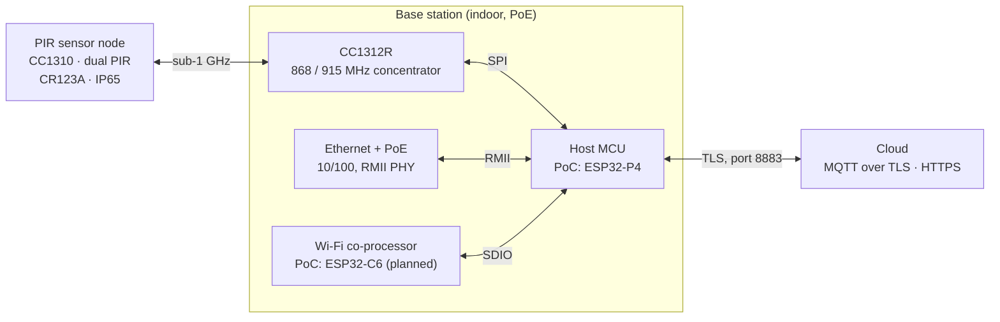

We want a design partner to turn our working proof of concept (PoC) into two
production products: a **base station** and a **battery PIR sensor node**.
This brief is the starting point for that conversation. It covers what the
PoC hardware is, what it has proven, and what we still need to decide with you.

**What we're asking for:**

- a component-level BOM for each product
- schematic capture and PCB layout, including the sub-1 GHz and 2.4 GHz RF sections
- advice on module versus chip-down choices, with certification cost in mind
- a view on what's missing from this brief before you can quote

The formal product requirements are the
[PIR Sensor v3](pir-v3-technical-requirements.md) and
[RAIS Base Station v3](rais-base-station-v3-technical-requirements.md)
technical requirements (project: PIRW 2026 Redesign). Requirement IDs such as
`PWR-1` below refer to those documents. Where the PoC and the requirements
disagree, the difference is listed under [Open questions](#open-questions).

## System overview

Battery PIR sensors count footfall and report over a sub-1 GHz link to an
indoor base station. The base station forwards the data to the cloud over MQTT
with TLS.

Every link is two-way. The base station sends ACKs and settings to sensors,
and the cloud sends commands and firmware updates down. Both products replace
an existing line (the PIRW2 sensor and the RAIS2.1 base station). v3 sensors
must also work with base stations already installed in the field, after a
concentrator firmware update (`RF-2`).

## Base station

### What the PoC is built from

| Part | Board used | Role in the PoC | Status |
| --- | --- | --- | --- |
| Host MCU | [M5Stack Unit PoE-P4](https://docs.m5stack.com/en/unit/Unit_PoE-P4) (SKU U213) | ESP32-P4NRW32: MQTT over TLS, OTA, web setup, RF node management | Working |
| Ethernet + PoE | On the same board | IP101GRI PHY over RMII; PoE input (board supplies up to 6 W) | Working, including MQTT over TLS |
| Sub-1 GHz concentrator | [TI LAUNCHXL-CC1312R1](https://www.ti.com/tool/LAUNCHXL-CC1312R1) | CC1312R runs the coordinator firmware and forwards node data to the host over SPI | Working on the bench with CC1310 nodes |
| Wi-Fi | ESP32-C6 (dev board) | Wi-Fi co-processor for the P4, using Espressif's esp-hosted firmware over SDIO | **Planned, not yet built** |

The P4 was chosen for the PoC because its RMII Ethernet runs MQTT over TLS
reliably. An earlier ESP32-S3 + W5500 SPI Ethernet build couldn't, because of
limits in the Arduino networking library it used. The ESP32-P4 has **no radio
of its own**, so Wi-Fi needs a second chip. That's why the C6 is in the plan.

### Not wanted in production

- The LaunchPad's XDS110 debugger, USB bridge, buttons and LEDs. Replace them
  with programming pads.
- M5Stack board features we don't use: display and camera FPC connectors, the
  USB host port and the infrared transmitter.
- Two PoC-only sensors: the HLK-LD2450 mmWave radar (UART) and an SPI thermal
  people counter that only ran against an emulated sensor. Neither is in the v3
  requirements.

### What production must add

| Requirement | Summary |
| --- | --- |
| `NET-1`, `NET-2` | 10/100 Ethernet on RJ45, with DHCP and static IP |
| `NET-4` | External, connectorised Wi-Fi antenna (e.g. RP-SMA) on the Wi-Fi variant |
| `PWR-1` | PoE, IEEE 802.3af Class 1, through an isolated PD front end |
| `PWR-2`, `PWR-3` | USB-C 5 V sink (5.1 kΩ CC pull-downs) as the alternative supply; clean PoE/USB-C arbitration |
| `RAD-3`, `RAD-4` | 868 MHz and 915 MHz variants, external sub-GHz antenna, per-band TX power respecting ERP limits |
| `PLT-2` | Field reflash of the CC1312 from the host through the TI ROM bootloader |
| `PLT-3` | Mutual watchdog: the host can reset the CC1312, and the CC1312 can reset the host |
| `MEC-1` | Indoor enclosure with RJ45, USB-C, both antennas, status LEDs and a label area (baseline RAIS2.1 is 137 × 91 × 24 mm) |

## Sensor node

The sensor PoC runs on a [TI LAUNCHXL-CC1310](https://www.ti.com/tool/LAUNCHXL-CC1310).
It proves the RF link and message format only: two GPIO inputs stand in for the
PIR elements and send trigger and dwell events. The production baseline is the
existing **PIRW2** board (CC1310F128RGZ, PCB antenna, CR2354 cell plus a 0.5 F
supercapacitor, hot-glue potting).

v3 changes the sensor significantly:

| Area | v3 requirement |
| --- | --- |
| Battery | CR123A (Li-MnO₂, 3 V), user-replaceable, standard holder (`PWR-2`) |
| Battery life | ≥ 3 years at 15,000 impressions/day, ≤ 1,200 mAh usable (`PWR-1`) |
| Sleep current | ≤ 5 µA target, ≤ 8 µA absolute maximum, with an itemised budget (`PWR-3`) |
| Supercapacitor | Evaluate removing the 0.5 F part (`PWR-5`) |
| Range | ≥ 99 % packet delivery at 50 m non-line-of-sight, 15–20 dB better link budget than PIRW2 (`RF-1`) |
| Bands | One design for 868 MHz and 915 MHz; antenna measured in both bands in the final enclosure (`RF-4`, `ENV-6`) |
| Enclosure | IP65 by design, not potting; UV-stable, black and white; −20 °C to +60 °C proposed (`ENV-1`, `ENV-3`) |
| Sealed openings | Fresnel lens as the IR window; membrane or magnetic reset; sealed LED light pipe (`ENV-2`) |

The larger CR123A board allows a bigger ground plane, and so a properly tuned
antenna. That's worth about 2–3 dB of the range target.

## Interfaces and pin map

These are the base-station PoC connections, on the M5Stack's Hat2-Bus
headers. A production board can choose its own pins; the table shows which
signals exist and how they're used.

| Signal | ESP32-P4 pin | Other end | Notes |
| --- | --- | --- | --- |
| CC1312 SPI MOSI | GPIO 8 | CC1312 DIO11 (SSI RX) | 1 MHz, SPI mode 1 |
| CC1312 SPI MISO | GPIO 9 | CC1312 DIO9 (SSI TX) | |
| CC1312 SPI CLK | GPIO 10 | CC1312 DIO10 | |
| CC1312 SPI CS | GPIO 11 | CC1312 DIO8 (SSI FSS) | Active low |
| CC1312 data ready | GPIO 12 | CC1312 DIO12 | Active low; the CC1312 signals that a frame is waiting |
| C6 SDIO CLK, CMD, D0–D3 | GPIO 43, 44, 39–42 (planned) | C6 GPIO 19, 18, 20–23 | 4-bit, 40 MHz; the P4's SDMMC pins |
| C6 reset | GPIO 13 (planned) | C6 EN | |
| Ethernet PHY | RMII: 28–30, 34, 35, 49, 50; MDC 31, MDIO 52, PHY reset 51 | IP101GRI | Fixed by the M5Stack board |
| Status LED (RGB, common anode) | GPIO 17 / 15 / 16 | | Red / green / blue |
| Factory reset button | GPIO 45 | | Active low |
| Debug console (UART0) | GPIO 37 (TX), 38 (RX) | | |

Signals production needs that the PoC doesn't wire:

- **CC1312 reset and bootloader lines** from the host (RESET_N plus the
  bootloader-entry DIO) for field reflash (`PLT-2`).
- **A CC1312 bootloader transport.** The v3 requirements assume a UART. The PoC
  data link is SPI and has no reflash path yet. Routing a UART as well as SPI
  keeps the known-good RAIS2.1 update method available.
- **A CC1312 → host reset line** for the mutual watchdog (`PLT-3`).
- **Programming pads** for each MCU on the production line: cJTAG for the
  CC13xx parts, and UART or USB plus the boot strap for the ESP32.

## Expansion header

We'd like the base station to accept extra sensors directly, not only over the
radio link. The PoC already works this way: the LD2450 radar (UART), the
thermal counter (SPI) and the CC1312 (SPI) all plug into the M5Stack's
Hat2-Bus header. Production should keep that ability through a defined
expansion header.

**Signals on the header:**

- 3.3 V and 5 V power, each current-limited, so a shorted add-on can't reset
  the base station
- I2C
- one UART
- SPI with two chip-selects, on a **separate SPI bus from the CC1312**, so a
  faulty add-on can't take down the sensor radio link
- two or three spare GPIOs, at least one usable as an interrupt
- a reset line
- all signals at 3.3 V logic, with ESD protection

**Which interface suits which add-on:**

| Where the add-on sits | Interface |
| --- | --- |
| Daughterboard plugged onto the header | SPI or I2C |
| Small module on a short cable (up to about 30 cm) | I2C (e.g. a Qwiic/STEMMA QT connector) or UART |
| Self-contained sensor, like the LD2450 | UART |
| Sensor several metres away | RS-485 (UART plus a transceiver), not raw SPI |

SPI is a board-level bus. It suits a plug-in daughterboard or a short ribbon
cable (roughly 10–20 cm at a few MHz), but not a long cable. It has no error
checking, long wires pick up noise, and each device needs its own chip-select.

**Other implications:**

- **Add-on identification.** A small ID EEPROM on each add-on board, on the
  header's I2C lines, would let the firmware detect what's fitted and load the
  right driver. Today add-ons are enabled at build time.
- **Power budget.** The header's power allowance has to fit within the PoE
  class (see [Power](#power) and [Open questions](#open-questions)).
- **Certification.** An exposed header affects EMC testing. Either test with a
  representative add-on fitted, or ship with the header covered and certify
  accessories separately.
- **Enclosure.** A cut-out or cover so the header is reachable without opening
  the case.

## Power

| Product | Source | Budget or target |
| --- | --- | --- |
| Base station | PoE 802.3af Class 1 (isolated PD, e.g. Ag99xx or Si34xx class) and USB-C 5 V | About 1.5–2 W worst case, estimated as roughly double the RAIS2.1's measured 175 mW average and 660 mW peak |
| Sensor node | One CR123A primary cell | ≥ 3 years at the worst-case traffic profile, ≤ 5 µA sleep |

A parameterised energy model for the sensor, validated against measured
current, is a project deliverable (`PWR-4`).

## RF, antennas and certification

- **Sub-1 GHz:** 868 MHz (UK/EU, ETSI EN 300 220) and 915 MHz (US, FCC) SKUs.
  The current base-station antenna covers 902–928 MHz only, so v3 needs a
  dual-band 863–928 MHz antenna or one antenna per SKU. At 868 MHz the limit is
  ERP, so conducted power must back off to allow for antenna gain (`RAD-4`).
- **Target PHY:** about 50 kbps GFSK at up to +14 dBm (`FW-2`), with ETSI duty
  cycle or listen-before-talk on both ends (`FW-3`).
- **Wi-Fi:** 2.4 GHz with an external antenna connector (`NET-4`).
- **Certification:** FCC (915 MHz), UKCA and CE RED (868 MHz), plus EMC and
  safety for the PoE and USB-C paths (EN 62368-1, EN 55032/55035). Pre-certified
  radio modules would reduce the test campaign; we'd value your view on where
  modules make sense.

## Memory, programming and OTA

| Item | PoC | Production need |
| --- | --- | --- |
| Host flash and PSRAM | 16 MB flash, 32 MB PSRAM (ESP32-P4NRW32); current firmware images are about 1.2 MB | Room for two firmware images (OTA with rollback) plus certificates; sizes to confirm |
| Host OTA | Triggered over MQTT; downloads over HTTPS (HTTP also accepted), checks SHA256, supports rollback | Keep, HTTPS only (`SEC-1`) |
| CC1312 update | No reflash path on the PoC yet | Required: host-driven reflash through the ROM bootloader, with rollback (`PLT-2`) |
| C6 update | esp-hosted supports updating the C6 from the host | Keep, if the C6 is used |
| Sensor update | Not implemented | To decide; it may need external SPI flash on the sensor |
| Secrets at rest | Stored in NVS | Encrypted storage using the MCU's flash/NVS encryption (`SEC-4`) |

## Commercial constraints

We still need to supply these before you can quote:

- [ ] Volumes per product and per SKU (868 / 915 MHz; Ethernet, Wi-Fi and cellular variants)
- [ ] Target unit cost per product
- [ ] Schedule and prototype milestones
- [ ] Enclosure responsibility (in-house or yours), including the sensor's mounting bracket and branding

## Open questions

1. **Host MCU.** The v3 requirements recommend a classic ESP32 with a LAN8720
   PHY (`PLT-1`), which gives Ethernet MAC and Wi-Fi on one chip. The PoC uses
   an ESP32-P4 plus an ESP32-C6. Which do you recommend for cost, BOM and
   certification? We don't depend on anything P4-specific beyond Ethernet
   with TLS.
2. **CC1312 reflash transport.** UART alongside SPI, or bootloader over SPI? The
   latter hasn't been verified.
3. **C6 pins, if the P4 is kept.** The planned SDIO pins are on a separately
   powered I/O group on the P4. We haven't yet measured whether the M5Stack
   runs it at 1.8 V or 3.3 V.
4. **Module or chip-down** for the CC1312R, the CC1310 and the Wi-Fi radio.
5. **Cellular variant.** The base-station requirements mention existing Wi-Fi
   and cellular variants. Is a cellular SKU in scope for v3?
6. **Sensor OTA.** Is external flash needed on the sensor to support future
   remote updates?
7. **PoE class with add-ons.** 802.3af Class 1 allows up to 3.84 W at the
   device. A power-hungry add-on such as a radar may need a higher class. What
   power allowance should the expansion header have?
8. **Sub-GHz PHY.** The PoC coordinator firmware currently uses TI's SimpleLink
   Long Range mode, which `FW-2` rules out as the default. This is a firmware
   change, but it affects the RF matching and the link budget you design for.

## Reference designs and documents

| Document | What it gives you |
| --- | --- |
| [TI LAUNCHXL-CC1312R1](https://www.ti.com/tool/LAUNCHXL-CC1312R1) | Schematic and layout for the CC1312R, including the RF match |
| [TI LAUNCHXL-CC1310](https://www.ti.com/tool/LAUNCHXL-CC1310) | Schematic and layout for the CC1310 |
| [CC1312R](https://www.ti.com/product/CC1312R) and [CC1310](https://www.ti.com/product/CC1310) product pages | Datasheets, technical reference manuals, bootloader details |
| [M5Stack Unit PoE-P4](https://docs.m5stack.com/en/unit/Unit_PoE-P4) | Mainboard, power board and HAT schematics (PDF) for the PoC host |
| [ESP32-P4 hardware design guidelines](https://docs.espressif.com/projects/esp-hardware-design-guidelines/en/latest/esp32p4/index.html) | Espressif's layout and power guidance |
| [ESP32-C6 hardware design guidelines](https://docs.espressif.com/projects/esp-hardware-design-guidelines/en/latest/esp32c6/index.html) | Espressif's layout and RF guidance |
| [CC1312R SPI interaction](development/cc1312r-spi-interaction.mdx) | The host ↔ CC1312 SPI protocol |
| [ESP32-C6 Wi-Fi co-processor plan](development/esp32-c6-wifi-coprocessor-plan.mdx) | The planned P4 ↔ C6 wiring |
| [v3 requirements gap review](v3-requirements-gap-review.md) | Where the PoC and the v3 requirements differ |
