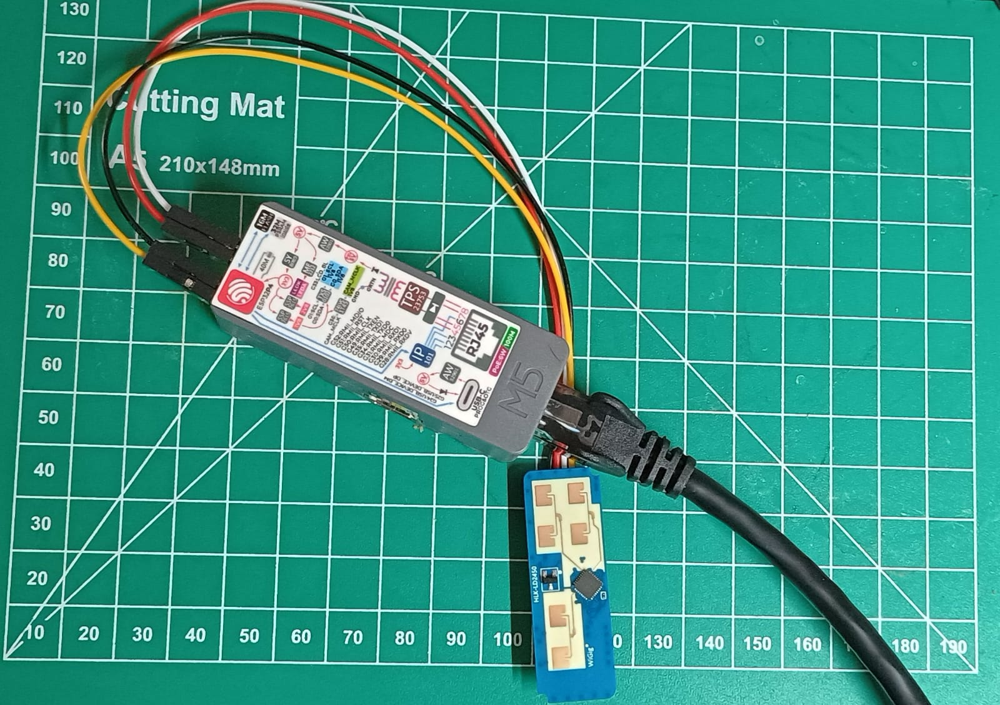

# HK-LD2450 mmWave Radar Sensor

## Overview

The HK-LD2450 is a 24 GHz mmWave radar module that reports position and speed for up to
3 simultaneous targets over a TTL UART link. It is used here for presence detection and
people tracking, publishing target data to MQTT.

The driver is implemented in `src/ld2450_sensor.h` (header-only, following the same pattern
as `thermal_detector.h`). It is enabled via the `ENABLE_LD2450` build flag, defaulting to 0
(off) so the firmware builds and runs normally on devices without the sensor wired.



## Hardware — M5Stack Unit PoE P4

### Wiring

The sensor connects to the **Hat2-Bus** (2.54mm 16P) connector on the Unit PoE P4.
The connector uses G-designations that map directly to ESP32-P4 GPIO numbers.

| LD2450 Pin | Hat2-Bus label | ESP32-P4 GPIO | Notes                         |
| ---------- | -------------- | ------------- | ----------------------------- |
| VCC        | 5V             | —             | SYS_5V (5 V) rail             |
| GND        | GND            | —             | Ground                        |
| **TX**     | **G19**        | GPIO 19       | Sensor TX → **ESP RX** (G19)  |
| **RX**     | **G20**        | GPIO 20       | Sensor RX ← **ESP TX** (G20)  |

> **Common mistake:** TX and RX must cross over — the sensor's TX goes to the ESP's RX pin
> (G19) and the sensor's RX receives from the ESP's TX pin (G20). Swapping them results
> in bytes arriving but no frames parsed.

Pin assignments confirmed from board silkscreen (G-labels) and the M5Stack Unit PoE P4
demo project (`main/app_gpio/user_gpio.h`).

### Voltage and Logic Levels

The LD2450 module requires **5 V power** (SYS_5V, available on M-Bus pin 1), but its UART
interface uses **3.3 V TTL logic**. Direct connection to the ESP32-P4 GPIO pins is safe —
no level shifter is required.

This was confirmed by the prior `wt32-eth01-ld2450` project, which connected the LD2450
directly to a 3.3 V ESP32 (WT32-ETH01) without a level shifter and operated correctly.

### Conflict Check

| GPIO | Use              | Available?                    |
| ---- | ---------------- | ----------------------------- |
| 15   | LED Green        | No — off M-Bus, on-board only |
| 16   | LED Blue         | No — off M-Bus, on-board only |
| 17   | LED Red          | No — off M-Bus, on-board only |
| 19   | **LD2450 RX**    | Yes — Hat2-Bus G19            |
| 20   | **LD2450 TX**    | Yes — Hat2-Bus G20            |
| 43   | UART0 console TX | Reserved                      |
| 44   | UART0 console RX | Reserved                      |
| 45   | Factory reset    | No — dedicated USR button     |

## UART Protocol

| Parameter | Value           |
| --------- | --------------- |
| Baud rate | 256,000         |
| Format    | 8N1             |
| UART      | UART1 (Serial1) |

### Frame Format (30 bytes)

```
AA FF 03 00          ← Header (4 bytes)
[Target 1: 8 bytes]
[Target 2: 8 bytes]
[Target 3: 8 bytes]
55 CC                ← Footer (2 bytes)
```

### Target Block (8 bytes, little-endian)

| Bytes | Field        | Type    | Unit |
| ----- | ------------ | ------- | ---- |
| 0–1   | X coordinate | int16\* | mm   |
| 2–3   | Y coordinate | int16\* | mm   |
| 4–5   | Speed        | int16\* | cm/s |
| 6–7   | Resolution   | uint16  | mm   |

\* Signed values use an offset encoding (not standard two's complement):

- If the MSB is **1**: value is **positive** — strip the flag: `raw - 0x8000`
- If the MSB is **0**: value is **negative** — negate: `-raw`

A target slot is empty (inactive) when all four fields are zero.

### Coordinate System

- **X**: lateral position — positive = right of sensor, negative = left
- **Y**: forward distance from sensor (always positive in practice)
- **Speed**: positive = approaching, negative = moving away

Angle is not reported directly; derive if needed: `atan2(y_mm, x_mm)`.

### Sensor Initialisation

On `begin()`, the driver sends three configuration commands to enable multi-target tracking:

```text
Enable config mode  → command 0x00FF, value [0x01, 0x00]
Set multi-target    → command 0x0090
Disable config mode → command 0x00FE
```

Command frame format:

```text
FD FC FB FA          ← Command header
[length: 2 bytes LE]
[command: 2 bytes LE]
[value bytes, if any]
04 03 02 01          ← Command footer
```

## MQTT

### Topic

```text
{prefix}/{device-id}/ld2450/targets
```

### Payload

Frames are buffered at up to 2 Hz and published as a batch every 10 seconds.
Only active (non-zero) target slots are included. Identical consecutive frames
are deduplicated and not buffered.

```json
{
  "timestamp": 123456,
  "frames": [
    {
      "timestamp": 123000,
      "targets": [
        { "id": 1, "x_mm": -782, "y_mm": 1713, "speed_cms": -16, "res_mm": 320 }
      ]
    },
    {
      "timestamp": 123500,
      "targets": [
        {
          "id": 1,
          "x_mm": -750,
          "y_mm": 1690,
          "speed_cms": -12,
          "res_mm": 320
        },
        { "id": 2, "x_mm": 210, "y_mm": 2100, "speed_cms": 5, "res_mm": 280 }
      ]
    }
  ]
}
```

| Field       | Description                              |
| ----------- | ---------------------------------------- |
| `timestamp` | Batch publish time (ms since boot)       |
| `frames`    | Array of up to 20 buffered frames        |
| `id`        | Target slot number (1–3)                 |
| `x_mm`      | Lateral position in mm (negative = left) |
| `y_mm`      | Forward distance in mm                   |
| `speed_cms` | Speed in cm/s (negative = moving away)   |
| `res_mm`    | Distance gate resolution in mm           |

## Build Configuration

In `platformio.ini`, `m5tab5-esp32p4` env:

```ini
-DENABLE_LD2450=0    ; set to 1 when sensor is wired up
```

Pin overrides (if wiring differs):

```ini
-DLD2450_RX_PIN=19
-DLD2450_TX_PIN=20
```

## Enabling the Sensor

1. Wire the sensor as per the table above.
2. In `platformio.ini`, change `-DENABLE_LD2450=0` to `-DENABLE_LD2450=1`.
3. Build and flash:
   ```bash
   pio run -e m5tab5-esp32p4 -t upload
   pio device monitor -e m5tab5-esp32p4
   ```
4. Expected boot log:
   ```text
   [LD2450] Initialized on UART1 RX=19 TX=20 @ 256000
   [LD2450] Multi-target tracking enabled
   ```
5. Verify MQTT output (wave hand in front of sensor):
   ```bash
   mosquitto_sub \
     -h <broker-ip> -p 8883 \
     --cafile ~/docker/mosquitto/mqtt/certs/ca.crt \
     --cert   ~/docker/mosquitto/mqtt/certs/client.crt \
     --key    ~/docker/mosquitto/mqtt/certs/client.key \
     -t 'sensors/#' -v
   ```

## Prior Art

The driver logic was ported from the `wt32-eth01-ld2450` project, which ran the same
sensor on a WT32-ETH01 (ESP32 + W5500 Ethernet). Key differences in this port:

- UART pins changed to GPIO 19/20 (M-Bus on Unit PoE P4)
- Batching and deduplication moved inside the driver class (self-contained, like `ThermalDetector`)
- Constructor takes `HardwareSerial&` and `MQTTManager&`
- Uses UART1 (`Serial1`) instead of `Serial2`
